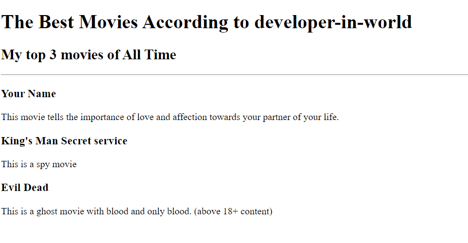

 # Developer-in-world's Portfolio Website

**Welcome to my personal portfolio website, showcasing my web development skills and projects!**

## Overview

This website is built using HTML only, demonstrating my ability to structure and organize content using fundamental web development technologies. It highlights the following projects:

* **Top 3 Movie Website:** View project: ./public/movie-ranking.html

* **Birthday Invite Site:** View project: ./public/birthday-invite.html

## Structure

The website is organized into the following sections:

* **Homepage:** Displays an overview of my projects and skills.
* **Project Pages:** Individual pages showcasing each project in detail.
* **About Me:** Information about my background and interests.
* **Contact Me:** A form to get in touch.

## Technologies Used

* **HTML:** For structuring the content and layout of the website.
* **Semantic HTML:** To ensure proper accessibility and maintainability.

## Setup Instructions

1. Clone this repository to your local machine.
2. Open the `index.html` file in your web browser.

## Contact

Feel free to reach out if you have any questions or feedback!

**Contact Me:** Link to contact : m.gnanendraworkmail@gmail.com

**I'm eager to continue learning and expanding my web development knowledge. Stay tuned for future updates and projects!**

**# Happy Coding!** 

